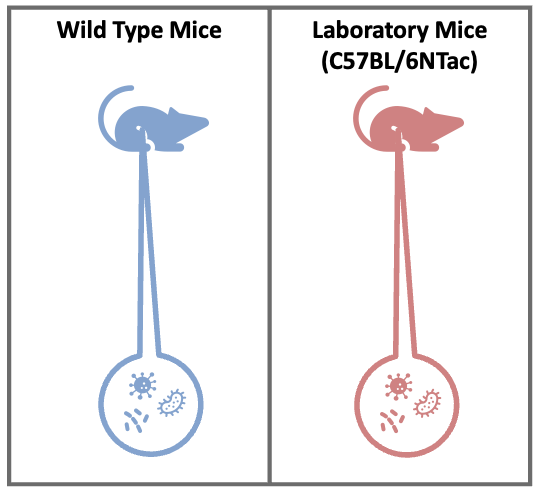

Introduction to the Microbiome
==============================

-  The microbiome refers to the collective set of genes belonging to the
   microbiota in a specimen. The term microbiota represents the
   community of microbes themselves.
-  Disturbances in the microbiome have been linked to multiple chronic
   conditions, including obesity, inflammatory bowel disease, alcoholic
   and nonalcoholic fatty liver disease, and hepatocellular carcinoma.

|image1|

Microbiome Variability
--------------------
-  Assessing a microbiome disturbance is not a trivial task as it is
   highly variable from person to person.
-  Large sample sizes, hundreds of patients, are needed to overcome
   interindividual variability.

|image2|

Sample Collection
--------------------

-  Sample collection is also a difficult challenge and highly dependent
   on the study question.
-  The microbiome can change in an individual over time, especially in
   diseases marked by flare ups like IBD.
-  Samples might not be representative of the site in question. For
   example, a stool sample sits in the rectum – an environment that is
   undergoing dehydration and fermentation which might select for
   different bacteria than in the small intestine.

|image3|

Confounding Factors
--------------------

-  When conducting a clinical experiment, it is pertinent to stratify
   accounting for age, gender, diet, etc.
-  Sampling over time is incredibly valuable as you can better capture
   intrapatient variability.
-  Additionally, the way the sample is processed can also confound your
   results

|image4|

What is an Amplicon?
--------------------

-  Microbiome Amplicon sequencing involves sequencing a specific gene
   from microbial community

|image5|

Why Sequence One Gene?
--------------------
-  Genes can vary per organism and may not be well conserved across
   species. To assess the microbial community composition, we need to
   sequence a conserved gene across organisms of interest:

   -  **16S ribosome DNA (rDNA)** for prokaryotes
   -  **18S rDNA** and internal transcribed spacers (ITS) for eukaryotes

-  In the selected gene there are different levels of conservation
   across organisms. To circumvent this parts of the gene with high
   conservation (like the V4 region of 16S rRNA) are selected for

|image6|

Our Data
--------

Today we will be analyzing the microbiome of wild type mice and the
C57BL/6NTac laboratory mouse strain, from `Rosshart et
al. (2107) <https://www.ncbi.nlm.nih.gov/pmc/articles/PMC6887100/>`__,
using amplicon data analysis:

|image7|

Amplicon Data Analysis
----------------------

The goal of amplicon data analysis is to generate amplicon sequence
variant table (also called feature table). Researchers can use this
table to conduct further downstream analysis including:

-  alpha/beta-diversity
-  taxonomic composition
-  difference comparison
-  correlation anlysis
-  network analysis

.. raw:: html

   <figure>

|image8|

.. raw:: html

   <figcaption>

Modified from Liu et al. Protein & Cell (2021)

.. raw:: html

   </figcaption>

.. raw:: html

   </figure>

Today we will be using the DADA2 method to perform our amplicon data
analysis!

Other 16S Analysis Methods
----------------------
- `USEARCH <https://drive5.com/usearch/>`__ -
- `Mothur <https://mothur.org/>`__ - `QIIME <http://qiime.org/>`__

.. |image1| image:: images/microbiome.png

