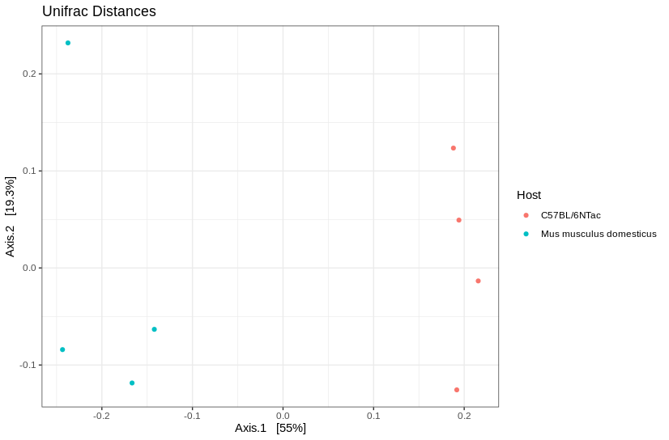

Diversity Analysis
==========================
Constructing the Phylogenetic Tree
----------------------------------

We will now construct a phylogenic tree based on our sequence data. To
construct our tree we will be first aligning our ASV’s using ClustalW
and then constructing a phylogenetic tree via the neighborhood joining
method.

.. note::

 To learn more about ClustalW and the neighborhood joining method visit: 
 - `Clustal W and Clustal X version 2.0 <https://academic.oup.com/bioinformatics/article/23/21/2947/371686?login=true>`_
 - `The neighbor-joining method: a new method for reconstructing phylogenetic trees. <https://academic.oup.com/mbe/article/4/4/406/1029664?login=true>`_

Let’s work this in R!

.. code:: r

   # extract sequences
   # name the sequences with their sequence so 
   # that the ends of the phylogenetic tree are labeled
   # align these sequences
   seqs <- getSequences(seqtab)
   names(seqs) <- seqs 
   mult <- msa(seqs, method="ClustalW", type="dna", order="input")

   # convert multiple sequence alignment to a phyDat object
   # calculate the nucleotide distances between ASVs
   # use a neighbor joining algorithm to generate the tree
   # finally calculate the likelihood of the tree given the sequence alignment
   phang.align <- as.phyDat(mult, type="DNA", names=getSequence(seqtab))
   dm <- dist.ml(phang.align)
   treeNJ <- NJ(dm)
   fit = pml(treeNJ, data=phang.align)

Making a PhyloSeq Object
------------------------

Once we have quantified our community, we can analyze its composition.
Two main methods of doing so are exploring the **alpha** and **beta**
diversity of the community. First we will need to take our taxonomic
data and pass it to the ``phyloseq`` package for easier manipulation:

.. code:: r

   # Create phyloseq object

   # upload meta data for study
   # ensure the rownames of our meta data are our sample name
   meta <- read.csv("../data/metaData.txt")
   rownames(meta) <- meta$Run

   # combine the ASV table, the meta data, and taxonomic data
   # to create the phyloseq object
   ps <- phyloseq(otu_table(seqtab.nochim, taxa_are_rows=FALSE), 
                  sample_data(meta), 
                  tax_table(taxa),
                  phy_tree(fit$tree)
                  )

   # Update ASV names to be shorter

   # The full ASV DNA sequence can be hard to look at
   # for this reason we move the sequence information to 
   # the refseq slot of the phyloseq object
   dna <- Biostrings::DNAStringSet(taxa_names(ps))
   names(dna) <- taxa_names(ps)
   ps <- merge_phyloseq(ps, dna)
   taxa_names(ps) <- paste0("ASV", seq(ntaxa(ps)))

To Rarefy Or Not To Rarefy?
---------------------------

-  Rarefaction curves are used to estimate the fraction of species that
   have been sequenced and usually result in a plot looking something
   like the following:

|image1|

!!! info “What does this mean?”

::

   - Green curve: a plateau is present and it appears that most species have been sequenced
   - Blue curve: this appears to be a species rich environment and we have not hit our plateau yet
   - Brown curve: only a small fraction of the species appear to have been sequenced as the curve is rapidly rising

-  There has been recent debate about whether or not to rarefy amplicon
   sequencing data:

   -  **Pros**: `Weiss et
      al. 2017 <https://microbiomejournal.biomedcentral.com/articles/10.1186/s40168-017-0237-y>`__
      have noted that sequencing depth has an effect on ordination space
      and how species richness is displayed
   -  **Cons**: `McMurdie and Holmes
      2014 <https://journals.plos.org/ploscompbiol/article?id=10.1371/journal.pcbi.1003531>`__
      have noted that this depends on the species richness metric.

-  In this tutorial we won’t be applying rarefaction to our data.

Alpha Diversity
---------------

-  **Alpha Diversity:** diversity of organisms sharing the same
   community or habitat. Alpha diversity metrics can look at richness,
   evenness, or both within a sample.

   -  Alpha Diversity Metrics:

      -  Faith’s PD: Phylogenetic diversity
      -  Observed OTUs: Richness of community
      -  Shannon: Balances richness and evenness
      -  Pielou’s Evenness: Evenness of community

-  We will use the Shannon or Simpson Diversity indices to measure this
   complexity per sample.

??? example “Optional: How to calculate these diversity metrics”
|image2|

-  Here we note:

   -  **Shannon Diversity Index:** higher values = higher diversity
   -  **Simpson Diversity Index:** higher values = higher diversity

In R we can visualize this with:

.. code:: r

   # Plotting Alpha Diversity Metrics
   plot_richness(ps, x="Host", measures=c("Shannon", "Simpson"), color="Host")+
     theme_bw()+
     theme(axis.text.x = element_text(angle=65,hjust=1))

|image3|

!!! note When running alpha and beta diversity plots you will notice
some errors. This is due to the subsampling we needed to do on this data
to ensure multiple users could run this workshop at the same time.

Beta Diversity
--------------

-  Beta Diversity: diversity between communities. Beta diversity
   calculates how similar two total ecosystems are.

   -  Beta Diversity

      -  Unweighted Unifrac: Presence / absence phylogenetic distance
         between samples
      -  Weighted Unifrac: Abundance weighted phylogenetic distance
         between samples
      -  Jaccard: Presence / absence distance between samples
      -  Bray Curtis: Abundance weighted distance between samples

-  Here we will use the weighted UniFrac distance since it aware of
   phylogenetic distances

??? example “Optional: How to calculate UniFrac Distance” |image4|

::

   - $N$ is the number of nodes in the tree
   - $S$ is the number of sequences represented by the tree
   - $L_i$ is the branch length between node $i$ and its parent 
   - $L_j$ is the total branch length from the root to the tip of the tree for sequence $j$
   - $A_i$ and $B_i$ are the number of sequences from communities $A$ and $B$ that descend from the node, 
   - $A_T$ and $B_T$ are the total number of sequences from communities $A$ and $B$.

   [Mothur UniFrac Alogrith](https://mothur.org/wiki/weighted_unifrac_algorithm/)

We can plot this in R code:

.. code:: r

   # calculate the unifrac distance between samples 
   # plot unifrac distances
   ordu = ordinate(ps, "PCoA", "unifrac", weighted=TRUE)
   plot_ordination(ps, ordu, color="Host")+
     theme_bw()+
     labs(title = "Unifrac Distances")

|image5|

Here we note that the wild type and C57BL/6NTac cluster together.

